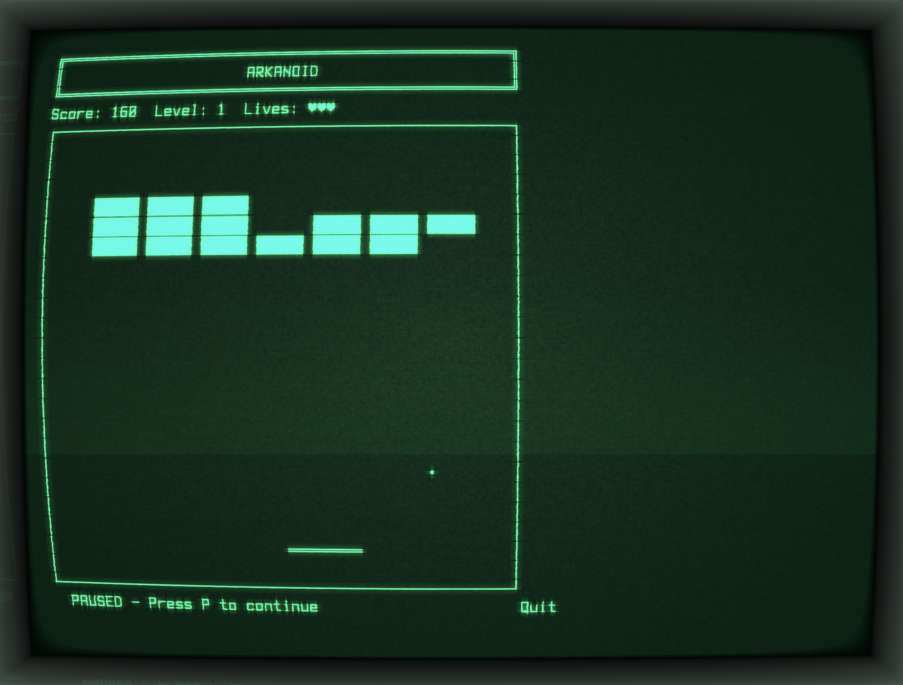

# cool-retro-term-webgl

A WebGL-based CRT terminal renderer for XTerm.js. This library provides authentic retro CRT visual effects for terminal applications, including screen curvature, phosphor glow, scanlines, and more.

### Preview 




Live demo available at https://remojansen.github.io/

## Installationq
```bash
npm install cool-retro-term-webgl
```

### Peer Dependencies

This library requires `three` and `@xterm/xterm` as peer dependencies:

```bash
npm install three @xterm/xterm
```

## Quick Start

```typescript
import { CRTTerminal } from 'cool-retro-term-webgl';
import { Terminal } from '@xterm/xterm';

// Create a container element
const container = document.getElementById('terminal')!;

// Initialize the CRT renderer
const crt = new CRTTerminal({ container });

// Create and configure your XTerm instance
const xterm = new Terminal({
  cols: 80,
  rows: 24,
  cursorBlink: false,
});

// XTerm needs a DOM element to attach to (can be hidden)
const hiddenContainer = document.createElement('div');
hiddenContainer.style.position = 'absolute';
hiddenContainer.style.left = '-9999px';
document.body.appendChild(hiddenContainer);
xterm.open(hiddenContainer);

// Attach XTerm to the CRT renderer
crt.attachXTerm(xterm);

// Now use XTerm as normal - output will render with CRT effects
xterm.write('Hello, CRT World!\r\n');
xterm.write('$ ');
```

## API Reference

### `CRTTerminal`

The main class that creates the WebGL renderer and manages the CRT effect pipeline.

#### Constructor

```typescript
new CRTTerminal(options: CRTTerminalSettings)
```

#### `CRTTerminalSettings`

| Property | Type | Default | Description |
|----------|------|---------|-------------|
| `container` | `HTMLElement` | **required** | The container element to render into |
| `fontColor` | `string` | `"#0ccc68"` | Font color in hex format (green) |
| `backgroundColor` | `string` | `"#000000"` | Background color in hex format |
| `screenCurvature` | `number` | `0.3` | Screen curvature amount (0-1) |
| `rgbShift` | `number` | `0` | RGB shift/chromatic aberration (0-0.01) |
| `bloom` | `number` | `0.5538` | Bloom intensity (0-1) |
| `brightness` | `number` | `0.5` | Brightness level (0-1) |
| `ambientLight` | `number` | `0.2` | Ambient light glow (0-1) |
| `chromaColor` | `number` | `0` | Chroma color (0=mono, 1=full color) |
| `flickering` | `number` | `0.1` | Flickering intensity (0-1) |
| `horizontalSync` | `number` | `0.08` | Horizontal sync distortion (0-1) |
| `jitter` | `number` | `0.1997` | Jitter/displacement (0-1) |
| `staticNoise` | `number` | `0.1198` | Static noise intensity (0-1) |
| `glowingLine` | `number` | `0.2` | Scanning beam intensity (0-1) |
| `burnIn` | `number` | `0.2517` | Phosphor burn-in persistence (0-1) |
| `rasterizationMode` | `number` | `1` | 0=none, 1=scanline, 2=pixel, 3=subpixel |
| `rasterizationIntensity` | `number` | `0.5` | Scanline intensity (0-1) |

#### Methods

| Method | Description |
|--------|-------------|
| `attachXTerm(xterm: Terminal)` | Attach an XTerm.js terminal instance |
| `detachXTerm()` | Detach the currently attached XTerm instance |
| `getGridSize()` | Get the terminal grid size `{ cols, rows }` |
| `focus()` | Focus the attached XTerm terminal |
| `dispose()` | Clean up all resources |

#### Advanced Access

For advanced usage, you can access the underlying components:

```typescript
crt.getTerminalText()  // TerminalText renderer
crt.getRenderer()      // THREE.WebGLRenderer
crt.getScene()         // THREE.Scene
crt.getCamera()        // THREE.OrthographicCamera
```

## Visual Effects

The library implements a two-pass rendering pipeline that replicates the visual characteristics of CRT monitors:

### Static Pass (Pass 1)
- Screen curvature distortion
- RGB shift (chromatic aberration)
- Bloom (phosphor glow)
- Brightness adjustment

### Dynamic Pass (Pass 2)
- Horizontal sync distortion
- Jitter (random displacement)
- Burn-in (phosphor persistence)
- Static noise
- Glowing line (scanning beam)
- Rasterization (scanlines)
- Flickering
- Ambient light

## Examples

### Custom Green Theme (Default)

```typescript
const crt = new CRTTerminal({
  container,
  fontColor: '#0ccc68',
  bloom: 0.6,
  screenCurvature: 0.3,
});
```

### Amber Terminal

```typescript
const crt = new CRTTerminal({
  container,
  fontColor: '#ffb000',
  bloom: 0.5,
  burnIn: 0.3,
});
```

### High-Fidelity CRT

```typescript
const crt = new CRTTerminal({
  container,
  screenCurvature: 0.4,
  flickering: 0.15,
  horizontalSync: 0.1,
  staticNoise: 0.15,
  burnIn: 0.3,
  rasterizationMode: 1,
  rasterizationIntensity: 0.6,
});
```

### Minimal Effects

```typescript
const crt = new CRTTerminal({
  container,
  screenCurvature: 0,
  flickering: 0,
  horizontalSync: 0,
  jitter: 0,
  staticNoise: 0,
  burnIn: 0,
  rasterizationMode: 0,
});
```

## Browser Support

Requires WebGL support. Works in all modern browsers:
- Chrome 56+
- Firefox 51+
- Safari 15+
- Edge 79+

## License

GPL-3.0

## Credits

This project is a port to WebGL from [cool-retro-term](https://github.com/Swordfish90/cool-retro-term) by Filippo Scognamiglio.

This library uses the [Terminus Font](https://terminus-font.sourceforge.net/) by Dimitar Zhekov, licensed under the SIL Open Font License (OFL).
